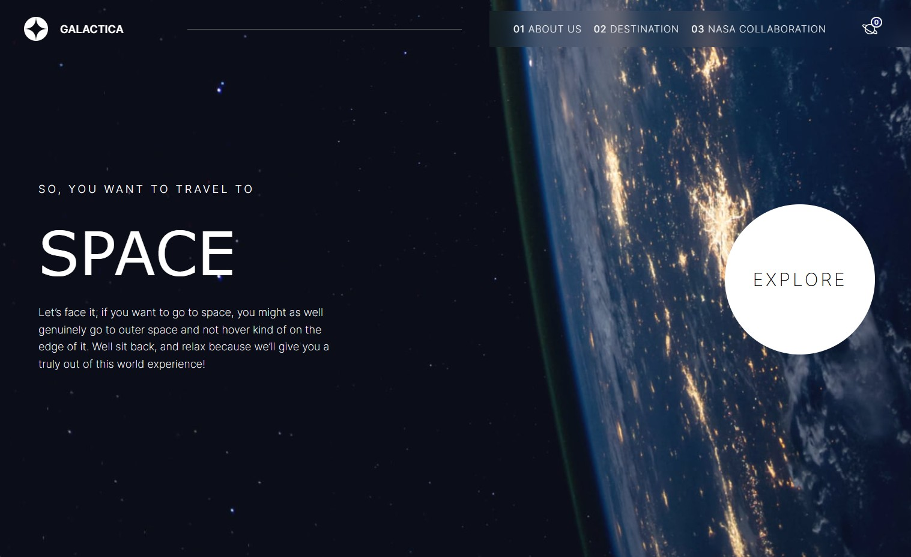

# Space Galactica



Space Galactica is a responsive Next.js web application showcasing planetary destinations, crew, and NASA collaboration features. It includes a mobile navigation experience, a wishlist for saved planets, and modular components built with CSS Modules.

## Live Demo

[View the deployed site](https://space-galactica-next.vercel.app/)

## Key Features

- Responsive layout with a mobile-friendly navigation and animated burger menu
- Destination pages with wishlist functionality
- NASA collaboration gallery and rover imagery components
- Reusable UI components (cards, badges, logos) styled with CSS Modules

## Tech Stack

- Next.js (App Router)
- React
- CSS Modules
- Vercel for deployment

## Getting Started

Prerequisites:

- Node.js (16+ recommended)
- npm, yarn, or pnpm

Install dependencies and run the development server:

```bash
npm install
npm run dev
# or
pnpm install && pnpm dev
```

Open `http://localhost:3000` in your browser to preview the site.

Build for production:

```bash
npm run build
npm start
```

## Project Structure

- `app/` — Next.js app routes and pages
- `src/components/` — UI components and CSS module files
- `src/contexts/` — React contexts (e.g., wishlist)
- `public/` — Static assets (images, logos)
